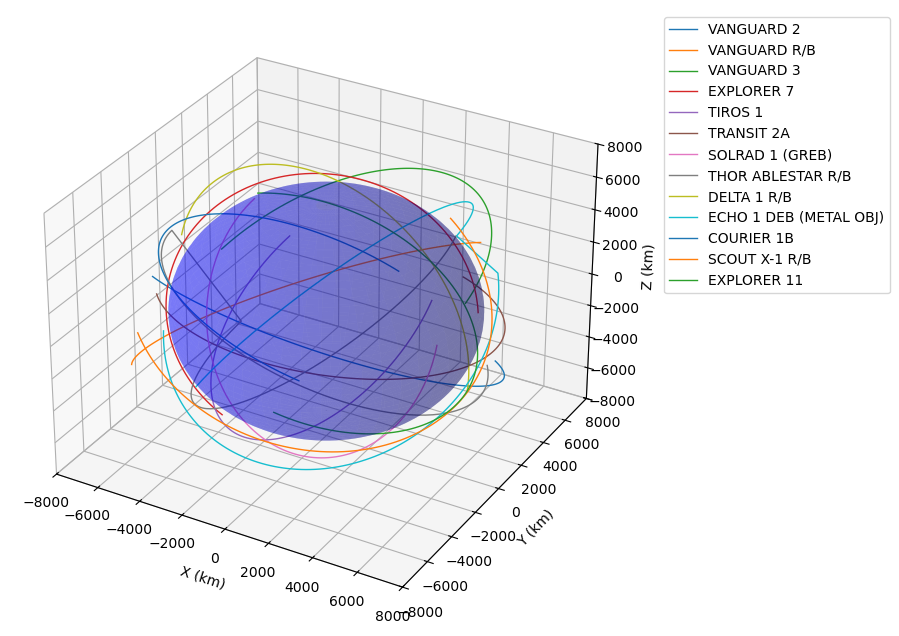
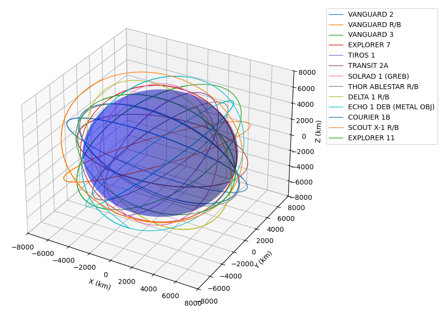
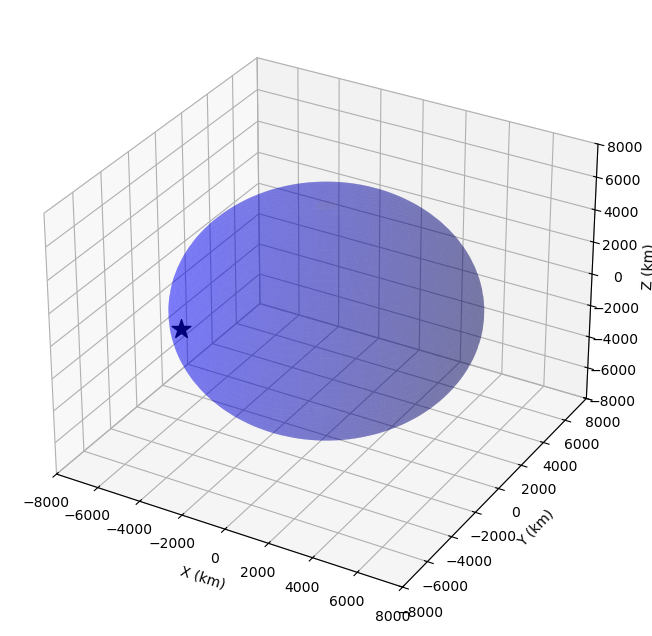
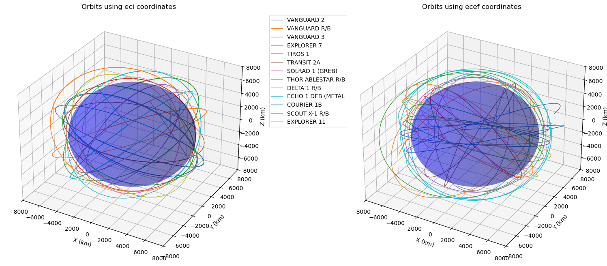

# Satellite Orbit visualisation using tle data

[한국어]

### Overview:
To understand tle data and how to visualise them using the sgp4 library and matplotplotlib.

### Steps

1) Data Collection: Getting tle data via API
2) Satrec Object Conversion: Using sgp4's Satrec object to calculate positions at intervals
3) Longitude and Latitude to ECEF conversion: Conversion and visualisation of longitude, latitude and altitude to ECEF format.
4) ECI to ECEF Conversion: Conversion and side to side visualisation of ECI to ECEF format.

### Libraries used 
matplotlib, numpy pandas, sgp4, datetime and astropy


## Task 1-1: Visualise Satellite trails using TLE

1) Get TLE data from the platform API.

```python
load_dotenv()
url = os.getenv ("tle_url")
page = requests.get(url)
content = page.json()["data"]["tles"]

for i in content:
    name = i.get('name')
    firstLine = i.get('firstLine')
    secondLine = i.get('secondLine')
    tle_data.append((name, firstLine, secondLine))

```

2) Cleanup data by formatting it properly into satelite name, first and second lines

```python
for name, firstline, secondline in tle_data[:15]:
    print(f"name: {name}\nfirstLine: {firstline}\nsecondLine: {secondline}\n")
```

3) imported the Satrec module from sgp4 to extract the satrec objects of satellites which are the most useful information for this project.

```python
from sgp4.api import Satrec

satellites_satrec = [] #contains the satellite name and its satrec object

for name, firstline, secondline in head_15:
    sat = Satrec.twoline2rv(firstline, secondline)
    satellites_satrec.append((name, sat))

```

4) imported the jday module from sgp4 to calculate the positions (and maybe velocity) for each satellite at each time stamp. Time was set to one hour, and the position is caputred every 60 seconds.

```python
from sgp4.api import jday

...

while current_time <= end_time:
    time_stamps.append(current_time)
    current_time += timedelta(seconds=30)

for name, sat in satellites_satrec:
    for time_point in time_stamps:
        jd, fr = jday(time_point.year, time_point.month, time_point.day,
                      time_point.hour, time_point.minute, time_point.second + time_point.microsecond * 1e-6)
        e, r, v = sat.sgp4(jd, fr)
        time_stamped_positions.setdefault(name, []).append((time_point, r, v))

```

5) Result (Visualisation)




## Task 1-2: Visualise Traces of a satellite's full cycle

1) steps 1 - 5 was the same as Task 1-1, except that step 5 had a little bit of modification in the for loop;

```python
mean_motion = sat.no_kozai  # Mean motion in radians per minute
    period_minutes = 2 * np.pi / mean_motion  # Period in minutes
    end_time = start_time + timedelta(minutes = period_minutes * 1.5) 

```
here, the period was calculated using the mean motion in radians per minute, and no_kozai is

2) Result (Visualisation)



## Task 1-3: Visualise a point on the earth in ECI coordinates on a globe

1) Used the Longitude and Latitude of my hometown, converted it to radians and then used standard Longitutde and Latitude to ECEF coordinates conversion to convert to ECEF values.

```python
#WGS84 Constants
a = 6378.137  # Earth's equatorial radius in km
e2 = 0.00669437999014  # Earth's eccentricity squared

...

# Convert to ECEF coordinates
x_ecef = (N + height) * np.cos(lat_rad) * np.cos(lon_rad) #
y_ecef = (N + height) * np.cos(lat_rad) * np.sin(lon_rad)
z_ecef = (N * (1 - e2) + height) * np.sin(lat_rad)

```
2) Conversion was made from ecef to eci using the astropy library. 

```python
...
# Convert using astropy
ecef = ITRS(x=x_ecef*u.km, y=y_ecef*u.km, z=z_ecef*u.km, 
            obstime=Time(datetime.now()))
eci = ecef.transform_to(TEME(obstime=ecef.obstime))

x_eci = eci.x.to(u.km).value
y_eci = eci.y.to(u.km).value
z_eci = eci.z.to(u.km).value

```
3) Result (Visualisation)





## Task 1-4: Comparing ECI and ECEF

1) Steps 1 - 5 were repeated from task 1-2 except that there were some changes made;
nb: no_kozai is used to calculate the orbital period in the sgp4 library.

2) Task 1-4 is a combination of task 1-3 and 1-2, and we calculate the period in ECEF format and also in ECI format to visualise them side to side. We create a time_stamped_positions_ecef, to calculate the positions of satellites at each time stamps for ecef just as we did for eci in task 1-2.

```python
...
time_stamped_positions_ecef = {}

for name, sat in satellites_satrec:
    mean_motion = sat.no_kozai  # Mean motion in radians per minute
    period_minutes = 2 * np.pi / mean_motion  # Period in minutes
    end_time = start_time + timedelta(minutes = period_minutes * 1.5) 
    current_time = start_time
    while current_time <= end_time:
            ...
        eci = TEME(x=r[0]*u.km, y=r[1]*u.km, z=r[2]*u.km,
                    v_x=v[0]*u.km/u.s, v_y=v[1]*u.km/u.s, v_z=v[2]*u.km/u.s,
                    obstime=Time(current_time))
        ecef = eci.transform_to(ITRS(obstime=eci.obstime))

        r_ecef = [ecef.x.value, ecef.y.value, ecef.z.value]
        v_ecef = [ecef.v_x.value, ecef.v_y.value, ecef.v_z.value]
        time_stamped_positions.setdefault(name, []).append((current_time, r, v))
        time_stamped_positions_ecef.setdefault(name, []).append((current_time, r_ecef, v_ecef))
        current_time += timedelta(minutes=2)
```

3) from the code snippet below, we extract the eci values (x, y and z) from r and then convert those values to ecef format, to get the current time and r for the ecef format.

```python
        eci = TEME(x=r[0]*u.km, y=r[1]*u.km, z=r[2]*u.km,
                    v_x=v[0]*u.km/u.s, v_y=v[1]*u.km/u.s, v_z=v[2]*u.km/u.s,
                    obstime=Time(current_time))
        ecef = eci.transform_to(ITRS(obstime=eci.obstime))
```


4) Results (Visualisation):




